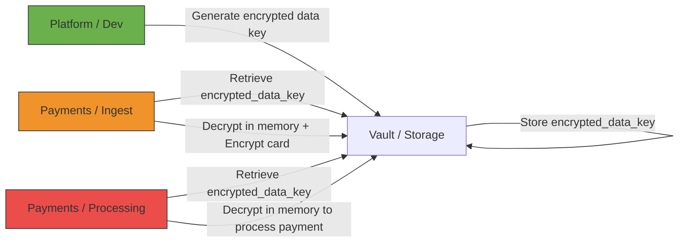

# Lab: Envelope Encryption with AWS KMS and Role Separation

This lab demonstrates how to handle sensitive information (e.g., credit cards) using **AWS KMS**, applying a pattern of **role separation** and **encrypted data keys**.  
The goal is not just to protect the credit card itself (encryption does that), but to **protect the organization and minimize human/operational risks**.


## Context

In distributed and multi-tenant systems:

- **Platform / Dev**: Creates containers or “vaults” for each customer.
- **Payments / Security**: Encrypts and decrypts sensitive data.
- **Storage**: Stores only encrypted data and encrypted data keys.

> This pattern ensures that the component creating containers **never sees plaintext keys or sensitive data**.


## Workflow

1. **Customer onboarding**
    - Platform calls `GenerateDataKeyWithoutPlaintext` from KMS.
    - Receives an **encrypted data key** (`encrypted_data_key`).
    - Platform stores `encrypted_data_key` in the customer vault (DB or S3).
    - Platform **never sees the key in plaintext**.

2. **Credit card ingestion**
    - Payments / Security retrieves the `encrypted_data_key`.
    - Calls KMS to decrypt the data key (only in memory).
    - Encrypts the credit card using the data key.
    - Deletes the data key from memory.
    - Stores the encrypted card in the vault.

3. **Payment processing**
    - A separate role (Payments processing) with minimal permissions decrypts the card **only when needed**.
    - Enables clear separation of **encrypt-only** and **decrypt-only** responsibilities.


## Roles and Permissions

| Role | KMS Permissions | Function |
|------|----------------|---------|
| Platform / Dev | `GenerateDataKeyWithoutPlaintext` | Create vaults and encrypted keys, never sees card data |
| Payments / Ingest | `kms:Decrypt` (data key) + `kms:Encrypt` | Encrypt cards at ingestion |
| Payments / Processing | `kms:Decrypt` (data key) | Decrypt cards to process payments |
| Storage | None | Stores only encrypted cards and encrypted data keys |


## Benefits of this Pattern

- 🔒 **Separation of responsibilities**: Minimizes human and access risks.
- 🔒 **Limited blast radius**: If one role is compromised, historical cards remain protected.
- 🔒 **Compliance**: Facilitates PCI-DSS and SOC2 audits.
- 🔒 **Key rotation and revocation**: Each vault can have its own data key, making rotation easier without re-encrypting all data.


## Example Repo Structure

```text
kms-envelope-encryption-lab/
├── README.md
├── dev_component/
│   └── create_vault.py
├── payments_component/
│   ├── encrypt_card.py
│   └── decrypt_card.py
└── cleanup.sh
``` 



### Diagram Explanation

- **A – Platform / Dev**: creates the vault and generates the `encrypted_data_key` with KMS, never sees plaintext data.  
- **B – Vault / Storage**: stores the encrypted data key and the encrypted cards.  
- **C – Payments / Ingest**: temporarily decrypts the data key in memory to encrypt new cards, then deletes the key.  
- **D – Payments / Processing**: temporarily decrypts the data key to process payments, separated from the ingestion flow.  


## Important Notes

- This lab is **not production-ready**.
- It does not include full tokenization or advanced key rotation.
- The goal is **to understand the pattern and responsibility flow**.


## References

- [AWS KMS - GenerateDataKeyWithoutPlaintext](https://docs.aws.amazon.com/kms/latest/APIReference/API_GenerateDataKeyWithoutPlaintext.html)
- [PCI-DSS Guidelines](https://www.pcisecuritystandards.org/)
